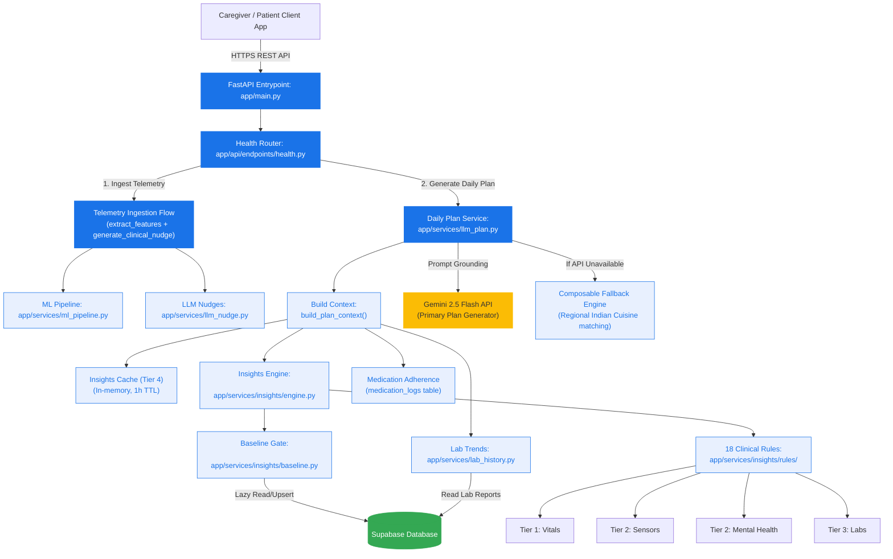
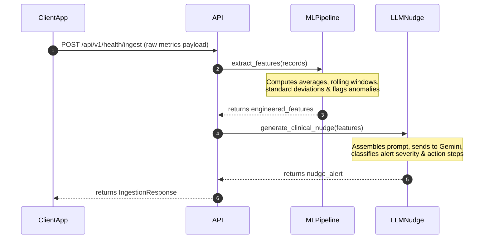
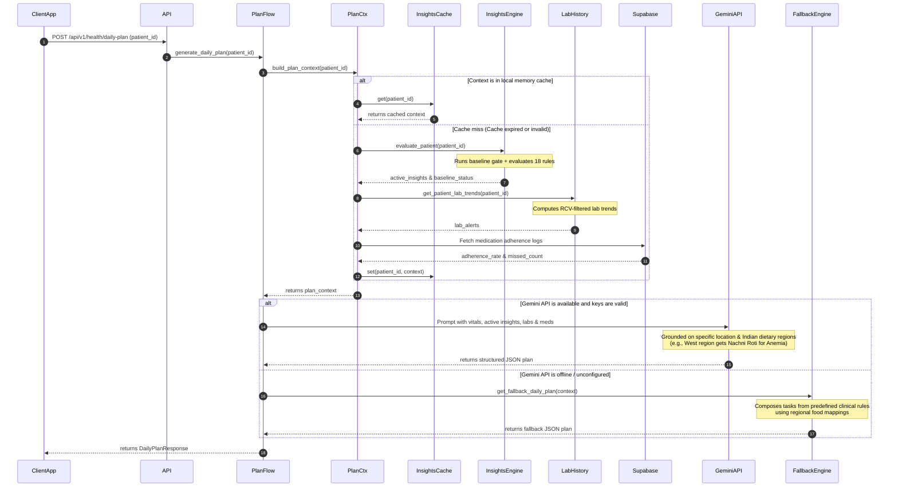

# Zivaa Backend Architecture Diagram & Reference Manual

This document provides a comprehensive blueprint of the **Zivaa Eldercare Backend Engine**. It covers the overall system topology, clinical data pipelines, baseline calibration gates, RCV-based lab trend analysis, LLM daily care plan generation, and compliance with security standards.

---

## 1. System Topology & Data Flow

The following topology outlines how the Zivaa backend handles real-time patient telemetry, lab reports, and medication compliance logs to generate clinically validated insights and daily care plans.

---

## 2. Directory Structure & Component Breakdown

The backend logic is modularized into discrete service layers:

- [app/main.py](file:///c:/Users/abhin/Downloads/Zivaa%20Apps/zivaa-backend/app/main.py): Registers FastAPI routes and configures application middleware.
- [app/api/endpoints/health.py](file:///c:/Users/abhin/Downloads/Zivaa%20Apps/zivaa-backend/app/api/endpoints/health.py): Defines ingestion, baseline, lab trends, daily plan, caregiver summary, and vitals card API endpoints.
- [app/services/](file:///c:/Users/abhin/Downloads/Zivaa%20Apps/zivaa-backend/app/services/):
  - [ml_pipeline.py](file:///c:/Users/abhin/Downloads/Zivaa%20Apps/zivaa-backend/app/services/ml_pipeline.py): Feature extraction from raw time-series data (e.g. daily step sums, resting heart rates, standard deviations).
  - [llm_nudge.py](file:///c:/Users/abhin/Downloads/Zivaa%20Apps/zivaa-backend/app/services/llm_nudge.py): Generates patient-facing clinical nudges from triggered insights.
  - [llm_plan.py](file:///c:/Users/abhin/Downloads/Zivaa%20Apps/zivaa-backend/app/services/llm_plan.py): Orchestrates context gathering, cache checks, and triggers Gemini (or fallback templates) to produce structured daily plans.
  - [lab_history.py](file:///c:/Users/abhin/Downloads/Zivaa%20Apps/zivaa-backend/app/services/lab_history.py): Compares patient biomarkers over time and filters biological noise using RCV.
  - [vitals_cards.py](file:///c:/Users/abhin/Downloads/Zivaa%20Apps/zivaa-backend/app/services/vitals_cards.py): Structures telemetry data into card objects for caregiver visualization.
  - [daily_summary.py](file:///c:/Users/abhin/Downloads/Zivaa%20Apps/zivaa-backend/app/services/daily_summary.py): Summarizes the patient's daily status for caregivers in 2 sentences.
  - [yesterday_metrics.py](file:///c:/Users/abhin/Downloads/Zivaa%20Apps/zivaa-backend/app/services/yesterday_metrics.py): Quickly retrieves key metrics from the previous day.
- [app/services/insights/](file:///c:/Users/abhin/Downloads/Zivaa%20Apps/zivaa-backend/app/services/insights/):
  - [engine.py](file:///c:/Users/abhin/Downloads/Zivaa%20Apps/zivaa-backend/app/services/insights/engine.py): Executes rules evaluation and sorts active insights by clinical severity (HIGH > MEDIUM > LOW).
  - [context.py](file:///c:/Users/abhin/Downloads/Zivaa%20Apps/zivaa-backend/app/services/insights/context.py): Houses `EvalContext` which abstracts patient vitals, lab reports, medication adherence, and demographics.
  - [baseline.py](file:///c:/Users/abhin/Downloads/Zivaa%20Apps/zivaa-backend/app/services/insights/baseline.py): Calibrates personalized patient baseline statistics and manages calibration/gap lifecycle status.
  - [data_fetcher.py](file:///c:/Users/abhin/Downloads/Zivaa%20Apps/zivaa-backend/app/services/insights/data_fetcher.py): Performs secure, unified service-role database operations to build execution contexts.
  - **rules/**: Implementations of Zivaa's 18 clinical rules split across tiers:
    - [tier1_vitals.py](file:///c:/Users/abhin/Downloads/Zivaa%20Apps/zivaa-backend/app/services/insights/rules/tier1_vitals.py): Monitors blood pressure anomalies and resting heart rate spikes.
    - [tier2_sensors.py](file:///c:/Users/abhin/Downloads/Zivaa%20Apps/zivaa-backend/app/services/insights/rules/tier2_sensors.py): Monitors sleep and step deviation against personalized baselines.
    - [tier2_mental_health.py](file:///c:/Users/abhin/Downloads/Zivaa%20Apps/zivaa-backend/app/services/insights/rules/tier2_mental_health.py): Evaluates PHQ-2 depression screens and mood scores.
    - [tier3_labs.py](file:///c:/Users/abhin/Downloads/Zivaa%20Apps/zivaa-backend/app/services/insights/rules/tier3_labs.py): Cross-references vital/sensor trends with lab reports (e.g. HbA1c, eGFR).

---

## 3. Core Clinical Pipelines

### A. Telemetry Ingestion Flow (`/ingest`)

When a patient wearable logs raw time-series metrics, they flow through the feature extraction pipeline before generating immediate caregiver warning notifications (nudges):

### B. Daily Plan Generation Flow (`/daily-plan`)

Daily plan generation is a context-rich process that dynamically personalizes recommendations by pulling all relevant clinical and demographic attributes:

---

## 4. Key Clinical Algorithms

### A. The Baseline Calibration Gate
To prevent "alert fatigue" and false positives from uncalibrated thresholds, the Insights Engine implements a strict baseline calibration workflow:
- **Minimum Calibration Period**: A first-time patient needs **5 days minimum** of telemetry data before any baseline-dependent rules will trigger.
- **Pre-evaluation Gate**: If a patient has less than the minimum required days, the engine returns early with `status: calibrating` and tells the caller how many days remain until calibration completes.
- **Recalibration & Gaps**: If a patient fails to wear their device consistently, causing a data gap of **>14 days**, the baseline state resets to `CALIBRATING`.
- **Staleness**: Baselines are automatically recalculated from historical data if they are older than **24 hours**.

### B. Reference Change Value (RCV) for Lab Trends
Instead of flagging every minor fluctuation in lab results, Zivaa employs **Reference Change Value (RCV)** equations derived from the **EFLM Biological Variation Database** (Aarsand 2018, Ricos 1999).
- **Formula**:
  $$RCV = 2^{1/2} \times Z \times \sqrt{CV_a^2 + CV_i^2}$$
  *(where $Z$ is the probability multiplier, $CV_a$ is analytical variation, and $CV_i$ is within-subject biological variation).*
- **Significance**: If a biomarker change (e.g., eGFR or HbA1c) exceeds the RCV threshold, it is classified as a true biological trend rather than analytical noise. The rule engine then triggers targeted alerts (e.g., KDIGO 2024 rapid progression alert if eGFR decline exceeds 5 mL/min/year).

---

## 5. Security & Compliance Architecture

The backend conforms strictly to the **Zivaa Security Blueprint v1.0**:

- **Data Minimisation (DPDPA 2023 / SPDI Rules 2011)**:
  - The `InsightsCache` stores only **Tier 4 (System/Derived)** data (i.e. rule IDs, plain-text descriptions, severity levels).
  - Raw **Tier 1 PHI** (individual lab values, exact vital readings, age) is never cached.
  - The cache is process-local and automatically expires after 1 hour. No persistent data stores or external files are used.
- **Row-Level Security (RLS)**:
  - Direct database queries from the frontend or caregivers are governed by Supabase RLS policies (e.g. `patient_baselines` is protected, and caregivers can only view their linked patients).
  - The backend insights engine processes data in a secure VPC using the Supabase `service_role` key to aggregate metrics, shielding the database credentials from client code.
