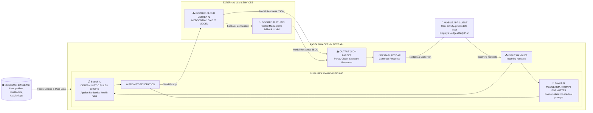
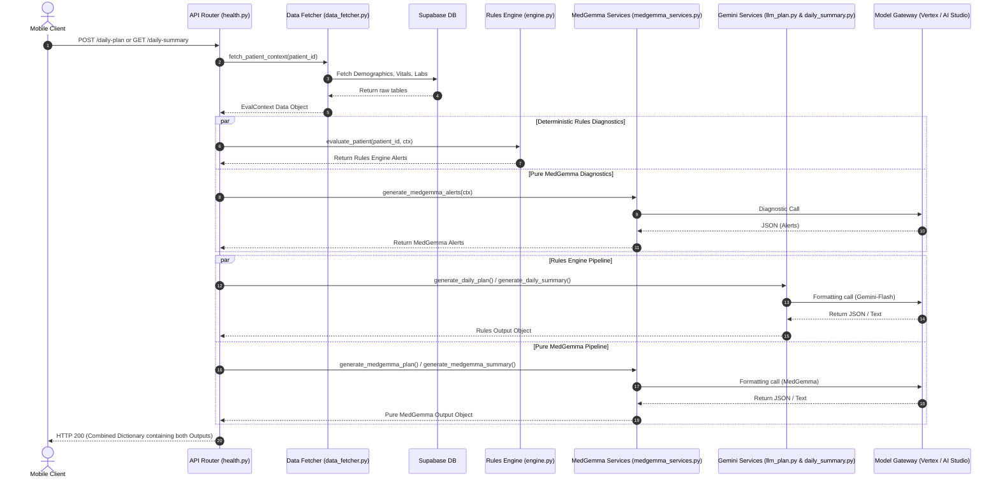
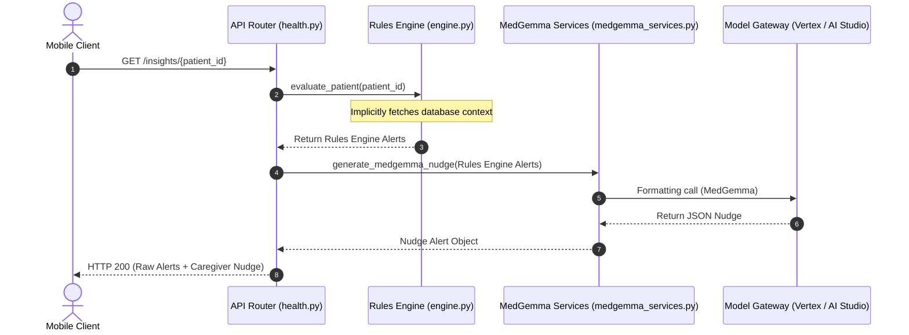

# MedGemma Backend Architecture

This document outlines the end-to-end architecture of the **MedGemma** integration in the Zivaa backend. It describes how wearable telemetry and patient history travel from the client application through the ingestion pipeline, data-fetchers, deterministic rules engine, and eventually into the parallel MedGemma reasoning wrappers, returning tailored clinical nudges and daily care plans.

---

## 1. High-Level System Architecture



---

## 2. End-to-End Execution Sequence Flow

The diagram below details the sequence of execution for a client requesting a daily plan or summary. It highlights the dual-generation pipeline where both the Deterministic Rules Engine and MedGemma are used independently to build the context.



---

## 2.1. Diagnostics & Caregiver Nudge Flow

When the caregiver opens their dashboard, the app specifically asks for diagnostic alerts and a short caregiver nudge, rather than a full daily plan. This flow is much shorter and relies exclusively on the Rules Engine.



---

## 3. Deep Dive into Pipeline Steps

### **Step 1: Patient Context, Math Injection & Stateful Pruning**
When an endpoint triggers a MedGemma request, it first calls [fetch_patient_context](file:///C:/Users/abhin/Downloads/Zivaa%20Apps/zivaa-backend/app/services/insights/data_fetcher.py) to run queries against Supabase. 

To optimize the LLM's performance and token usage, the context formatter applies two key strategies:
* **Math Injection:** LLMs notoriously struggle with complex floating-point math. Instead of asking the model to find anomalies, the backend pre-calculates **Z-Scores** (for vitals compared to baselines) and **RCV (Reference Change Values)** for lab trends. These are injected into the text prompt as explicit strings (e.g., `[CRITICAL SPIKE: +2.4 standard deviations]`), guiding the model's reasoning deterministically.
* **Stateful Context Pruning (Heavy vs Light Mode):** 
  * **Heavy Mode:** Triggered during a lab ingest. The full historical lab array is passed to the LLM for a deep evaluation. It reconciles findings against its "Stateful Memory" (existing database insights), updating controlled issues to `LOW` severity without dropping them to maintain tracking continuity.
  * **Light Mode:** Triggered during daily vital spikes. Expensive lab arrays are pruned. The LLM only receives a summary of `active_insights` fetched from the database and focuses strictly on explaining the acute vital anomaly.

It then forks into two parallel diagnostic evaluation processes:
1. **Insights Rules Engine:** Evaluates 18 clinical deterministic rules compiling multi-day trends into list flags.
2. **MedGemma Alerts:** Uses the `MedGemma` LLM model to logically diagnose the context and return its own alerts.

### **Step 2: Dual Generation Pipelines**
Endpoints like `/daily-plan` and `/daily-summary/{patient_id}` execute both AI generation processes simultaneously using `asyncio.gather()`. The generators formulate structured prompts from the contexts and request a JSON response containing the plan or summary text. Note that `/daily-summary/{patient_id}` has been optimized to fetch active alerts directly from the database rather than generating them synchronously.

### **Step 3: Prompt Wrapping & Structured Output Enforcement**
MedGemma endpoints compile the context parameters into structured prompts. 

To strictly enforce JSON compliance and prevent the model from generating markdown wrappers or conversational filler:
* **Structured Output Schema:** A JSON Schema (`responseSchema`) is passed directly into the generation config. This forces the model's internal logits to only generate valid JSON tokens that match the required schema.
* **Instruct Prompt Wrapping:** If using a raw Vertex AI model endpoint, the prompt is manually wrapped inside the Gemma Instruct chat template:
```text
<start_of_turn>user
{Prompt Content}
<end_of_turn>
<start_of_turn>model
Output:
{
```
This tricks the raw model into believing it has already started writing a JSON dictionary, bypassing any preamble.
This forces the model to ignore conversational filler and directly emit the JSON payload.

### **Step 4: Robust Gateway Invocations**
The `_call_medgemma` function operates as an intelligent gateway:
* **GCP OAuth Authorization:** Extracts tokens starting with `ya29.` for Vertex AI requests.
* **Fallback Routing:** If GCP credentials fail or are misconfigured, it automatically reroutes the prompt to Google AI Studio with `gemini-2.5-flash` to ensure there are no service interruptions.
* **429 Mitigation:** Retries are performed asynchronously using backoffs up to 4 times.

### **Step 5: Output Delivery**
Outputs are post-processed through `_clean_json` to isolate valid JSON dictionaries from any extraneous thinking blocks. The API router then packages the outputs from both the Rules Engine pipeline and the Pure MedGemma pipeline into a combined JSON dictionary and serves it back to the client application.
